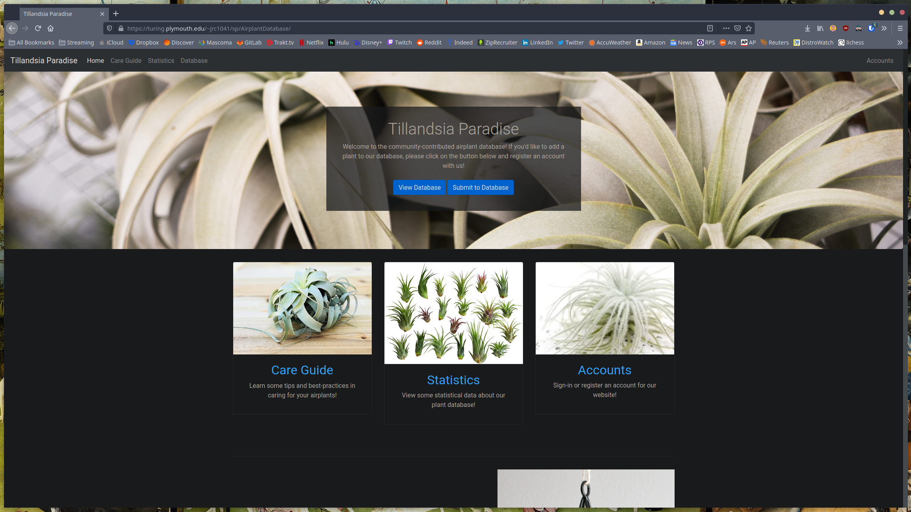
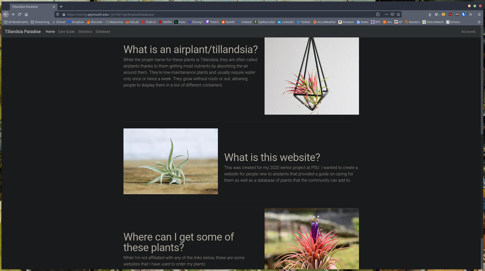
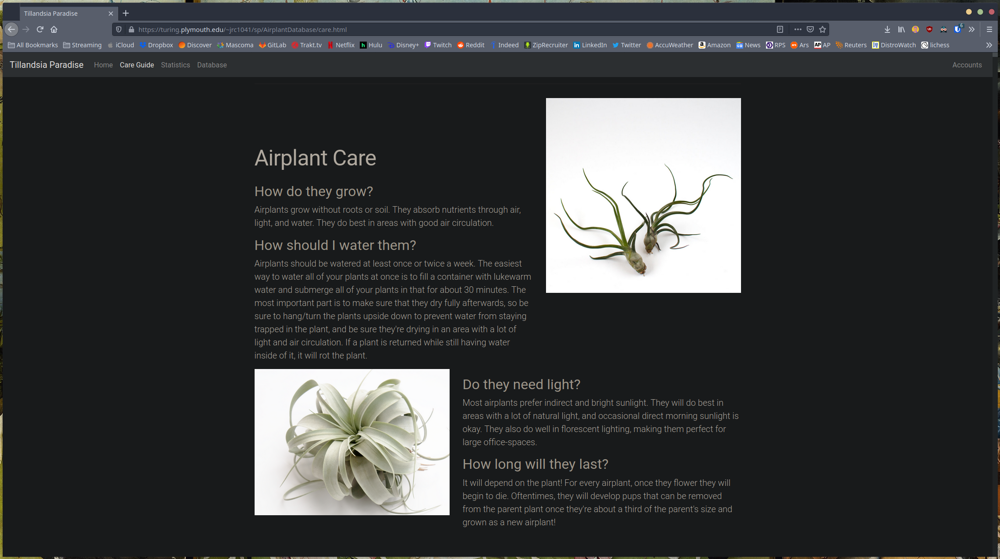
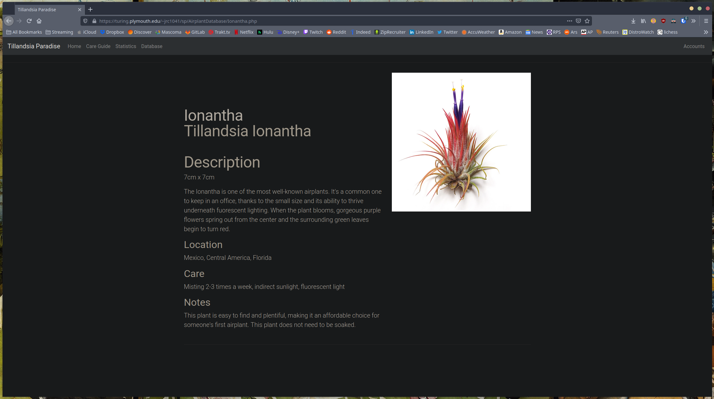

# tillandsia-paradise

Website and database created as a 2020 senior project for Plymouth State University.
The website was hosted on a school server, and as such the files that the site used to connect to the database have been removed before being added to this repo.

This repo is hosted on [Gitlab](https://gitlab.com/joejazzy06/tillandsia-paradise) and is being mirrored to [Github](https://github.com/JoeJazzy/tillandsia-paradise).

This website used Bootstrap for the styling and mobile-device functionality. It connected to a MariaDB database that held all of the plant information for the website. Using php and MariaDB, users could create accounts and submit their own plants to the database for others to view on the website.

